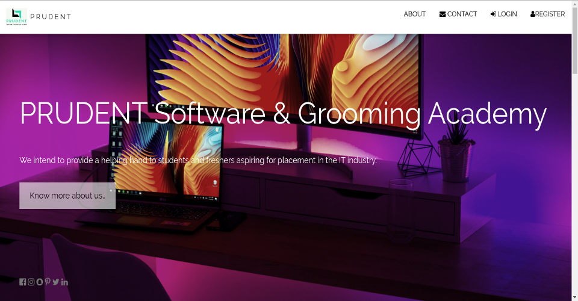
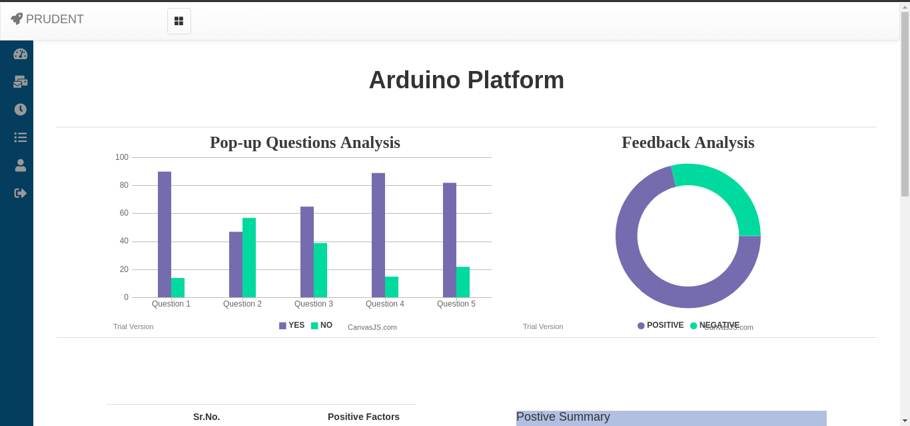
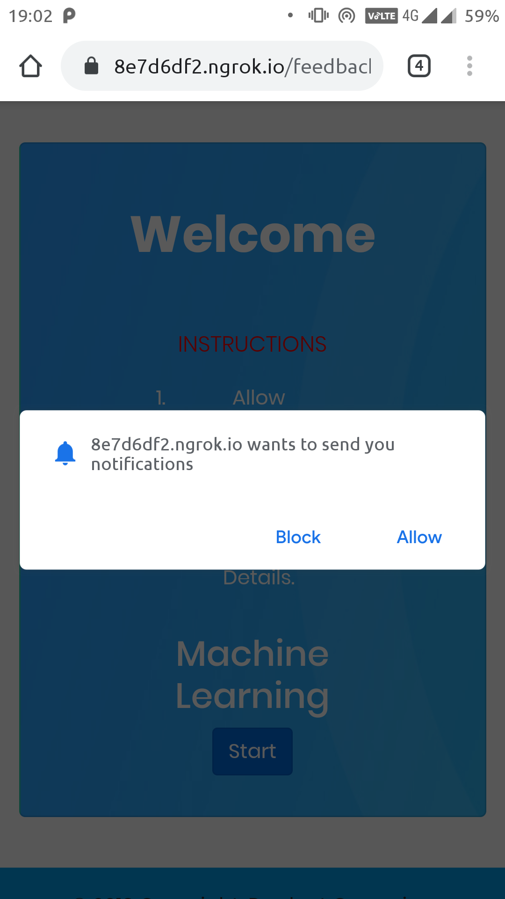
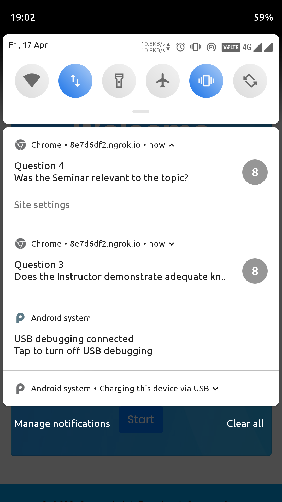

# Cloud Based Contacts Management System
## Final Year Undergraduate Project

This project was sponsored by [Prudent Software & Grooming Academy](http://psgapune.com/), Pune.

### Description
> - The application allows the Admin to schedule workshops/seminars throughout the cities to allow students to participate and engage in these workshops.
> - It (application), basically deals with data *(mostly text)* and its retrieval to **generate reports**.
> - It has 2 use cases, **Admin** and the **Student/Participant**.
> - The Admin has access to generation of reports, inviting participants and reviewing the data.
> - The Participant has only access to QnA, and providing feedback for appeared workshop/seminar.
> - The data was stored on AWS's **RDS** and the application deployed on AWS's **EC2** instance.

### Working
> #### Participant
>   > - The participant will scan a **QR code** and then follow a series of **QnA** while attending the workshop. After the QnA section the participant will be prompted to proivde feedback with his/her basic contact details.
>   > - S/he will then submit the feedback and get and **e-certificate** of participation instantly.
> #### Admin
>   > - The admin arrange/edit/delete the workshop.
>   > - S/he can also invite the participants who seem potential learners.
>   > - For every workshop conducted the feedbacks are stored overtime to generate report.
>   > - These reports are generated for each workshop conducted based on the feedback provided.

### Preview

